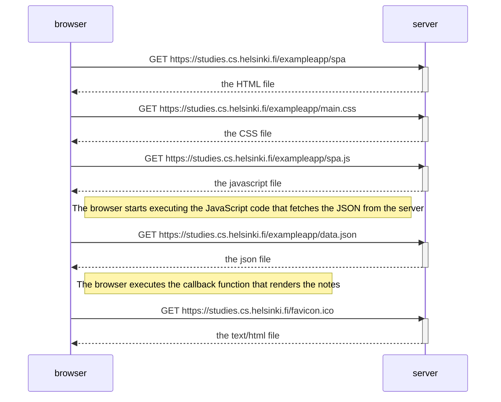

# Exercise 0.5-Fullstack-Developer-Course
Exercises for Fullstack Developer course part 0

```mermaid
sequenceDiagram  
  browser->>server: GET https://studies.cs.helsinki.fi/exampleapp/spa;
  activate server;
  server-->>browser: the HTML file;
  deactivate server;
  
  browser->>server: GET https://studies.cs.helsinki.fi/exampleapp/main.css
  activate server;
  server-->>browser: the CSS file;
  deactivate server;
  
  browser->>server: GET https://studies.cs.helsinki.fi/exampleapp/spa.js
  activate server;
  server-->>browser: the javascript file;
  deactivate server;
  
  Note right of browser: The browser starts executing the JavaScript code that fetches the JSON from the server;
  
  browser->>server: GET https://studies.cs.helsinki.fi/exampleapp/data.json
  activate server;
  server-->>browser: the json file;
  deactivate server;
  
  Note right of browser: The browser executes the callback function that renders the notes
  
  browser->>server: GET https://studies.cs.helsinki.fi/favicon.ico
  activate server;
  server-->>browser: the text/html file;
  deactivate server;  
```
