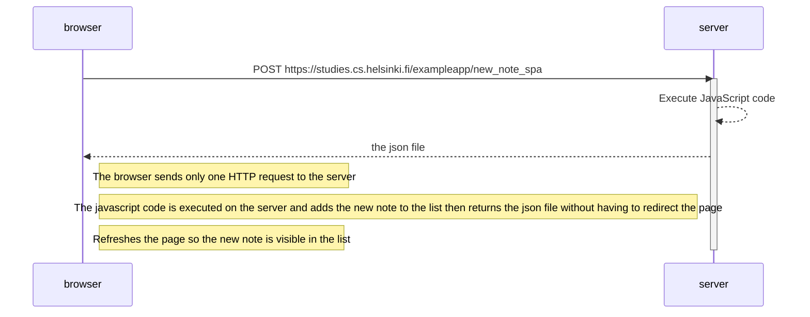

# Exercise 0.6-Fullstack-Developer-Course
Exercises for Fullstack Developer course part 0

```mermaid
sequenceDiagram  
  browser->>server: POST https://studies.cs.helsinki.fi/exampleapp/new_note_spa;
  activate server;
  server-->>server: Execute JavaScript code;
  server-->>browser: the json file
  
  Note right of browser: The browser sends only one HTTP request to the server
  Note right of browser: The javascript code is executed on the server and adds the new note to the list then returns the json file without having to redirect the page;
  Note right of browser: Refreshes the page so the new note is visible in the list;
  deactivate server;
```
